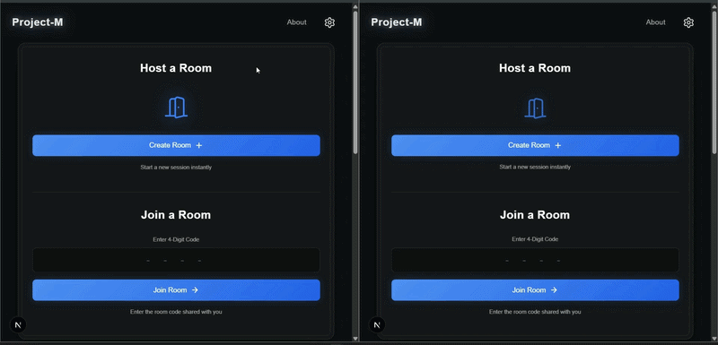

# Project-M: Secure P2P Real-Time Chat

Project-M is a secure, real-time web application built to explore WebSockets and WebRTC. It allows two users to connect in a disposable, temporary room for instant messaging and direct peer-to-peer file sharing. 

By leveraging WebRTC Data Channels, files bypass the server entirely and are transferred directly between clients. Text messages are transmitted via WebSockets and secured with client-side AES encryption.

---

## ✨ Features

* **Peer-to-Peer File Transfers:** Share heavy files (up to 500MB) directly between browsers using WebRTC without server storage limits.
* **Encrypted Messaging:** Text payloads are encrypted on the client side using AES-256 before being broadcasted over Socket.io.
* **Disposable Rooms:** Strict 2-user limit per room. Rooms are automatically destroyed when users disconnect.
* **Real-Time UI:** Live typing indicators, custom audio notifications, and dynamic user-count tracking.
* **Network Resiliency:** Implements strict connection guards and graceful error handling for dropped connections or corrupted data.

---

## 🛠️ Tech Stack

**Frontend:**
* React.js (Next.js App Router)
* CSS Modules
* WebRTC API (RTCPeerConnection, RTCDataChannel)
* CryptoJS (AES Encryption)

**Backend / Signaling Server:**
* Node.js
* Socket.io

---

## 🏗️ Architecture overview

1. **Signaling (Socket.io):** When users join a room, the Node.js backend passes Session Description Protocol (SDP) offers, answers, and ICE candidates between them. 
2. **Connection (WebRTC):** Once the handshake is complete, a direct Peer-to-Peer connection is established between the two browsers.
3. **Data Transfer:** Files are chunked and sent directly through the WebRTC data channel, completely bypassing the backend server. Text messages are encrypted with the room code and relayed through the Socket server.